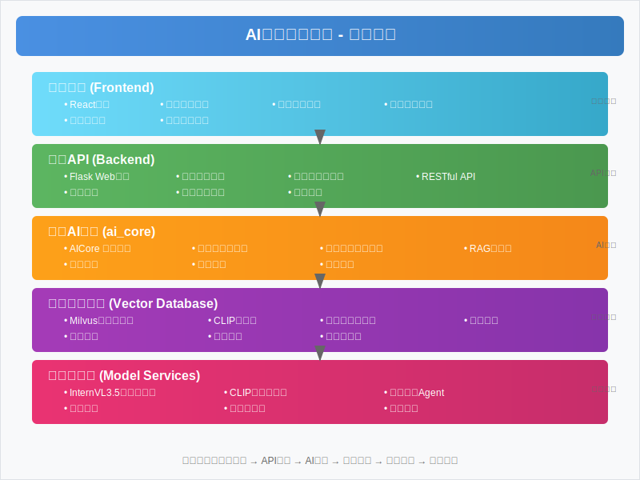

# 🏺 AI古董鉴定系统

一个基于多模态AI技术的智能古董鉴定系统，集成了图像识别、自然语言处理、向量数据库检索等先进技术，为用户提供专业化的古董分析和鉴定服务。

## ✨ 项目特色

- 🤖 **多模态AI分析**: 集成InternVL3.5多模态大模型，同时理解图像和文本
- 🔍 **智能相似度检索**: 基于CLIP编码器和Milvus向量数据库的高效检索
- 📊 **RAG知识库系统**: 专业古董知识库，提供准确的背景信息
- 🚀 **流式处理**: 实时生成分析结果，提升用户体验
- 🎯 **专业化定制**: 针对古董鉴定场景深度优化
- 🔧 **模块化架构**: 易于扩展和维护的组件化设计

## 🏗️ 系统架构



### 架构层次说明

#### 🎨 前端界面层 (Frontend)
- **React应用**: 现代化的单页面应用，提供流畅的用户体验
- **图像上传组件**: 支持拖拽上传、预览、格式验证等功能
- **结果展示组件**: 实时显示分析结果，支持流式输出
- **用户交互界面**: 响应式设计，适配多种设备

#### 🌐 后端API层 (Backend)
- **Flask Web服务**: 轻量级Web框架，提供RESTful API
- **图像处理服务**: 图像预处理、格式转换、质量优化
- **报告格式化服务**: 结构化输出分析报告
- **用户管理**: 用户认证、权限控制、会话管理

#### 🧠 核心AI引擎层 (ai_core)
- **AICore主控制器**: 统一管理所有AI组件，提供核心API
- **OptimizedQueryProcessor**: 智能查询路由和优化处理
- **多模态模型客户端**: InternVL3.5模型的封装和调用
- **RAG知识库系统**: 检索增强生成，提供专业背景知识

#### 🗄️ 向量数据库层 (Vector Database)
- **Milvus向量数据库**: 高性能向量存储和检索
- **CLIP编码器**: 图像和文本的统一向量化编码
- **相似度检索引擎**: 基于余弦相似度的快速检索
- **向量索引**: IVF_FLAT索引优化检索性能

#### 🤖 模型服务层 (Model Services)
- **InternVL3.5多模态模型**: 图像理解和文本生成的核心模型
- **CLIP视觉编码器**: 图像特征提取和多模态对齐
- **古董专家Agent**: 基于LangChain的专业问答代理

### 数据流向
```
用户上传图像 → 前端预处理 → 后端API → AI引擎分析 → 向量检索 → 模型推理 → 结果返回 → 前端展示
```

## 🚀 核心功能

### 📸 图像分析
- **多模态理解**: 同时分析图像内容和用户描述
- **相似度检索**: 在知识库中查找相似古董
- **专业鉴定**: 提供详细的古董分析报告
- **流式输出**: 实时生成和展示分析结果

### 💬 智能对话
- **专业问答**: 基于古董知识的智能问答
- **上下文记忆**: 支持多轮对话和上下文理解
- **个性化服务**: 根据用户需求定制回答

### 🗄️ 知识管理
- **自动初始化**: 系统启动时自动构建知识库
- **增量更新**: 支持知识库的动态更新
- **批量处理**: 高效的大规模数据处理能力

## 🛠️ 技术栈

### 前端技术
- **React**: 现代化的用户界面框架
- **JavaScript**: 交互逻辑实现
- **CSS**: 响应式界面设计

### 后端技术
- **Python 3.8+**: 主要开发语言
- **Flask**: 轻量级Web框架
- **Gunicorn/Waitress**: 生产级WSGI服务器

### AI技术
- **InternVL3.5**: 多模态大语言模型
- **CLIP**: 图像-文本编码器
- **LangChain**: AI应用开发框架
- **PyTorch**: 深度学习框架

### 数据存储
- **Milvus**: 向量数据库
- **Redis**: 缓存和会话存储
- **MinIO**: 对象存储服务

### 基础设施
- **Docker**: 容器化部署
- **Nginx**: 反向代理和负载均衡
- **etcd**: 分布式配置管理

## 📋 系统要求

### 硬件要求
- **CPU**: 4核心以上推荐
- **内存**: 8GB以上推荐
- **GPU**: NVIDIA GPU（可选，用于加速推理）
- **存储**: 20GB以上可用空间

### 软件要求
- **操作系统**: Windows 10+, macOS 10.15+, Ubuntu 18.04+
- **Python**: 3.8或更高版本
- **Docker**: 20.10或更高版本
- **Node.js**: 16.0或更高版本（前端开发）

## 🚀 快速开始

### 1. 克隆项目
```bash
git clone <repository-url>
cd llm
```

### 2. 环境配置
```bash
# 复制环境变量配置文件
cp .env.example .env

# 编辑配置文件，设置必要的参数
# 如 OpenAI API密钥、Milvus配置等
```

### 3. 启动服务

#### Windows用户
```bash
# 使用批处理脚本启动
start.bat
```

#### Linux/macOS用户
```bash
# 使用Shell脚本启动
./start.sh
```

#### Python启动方式
```bash
# 使用Python脚本启动
python start.py
```

### 4. 访问应用
- **前端界面**: http://localhost:3000
- **后端API**: http://localhost:5000
- **API文档**: http://localhost:5000/docs

## 📖 使用指南

### 图像分析
1. 在前端界面上传古董图片
2. 可选择添加文字描述
3. 点击"开始分析"按钮
4. 查看实时生成的分析报告

### API调用
```python
import requests

# 图像分析API
response = requests.post(
    'http://localhost:5000/api/analyze',
    files={'image': open('antique.jpg', 'rb')},
    data={'description': '这是一个青花瓷器'}
)

result = response.json()
print(result['analysis'])
```

## 🔧 配置说明

### 环境变量配置
```bash
# OpenAI API配置（可选）
OPENAI_API_KEY=your_openai_api_key_here

# Milvus向量数据库配置
MILVUS_HOST=localhost
MILVUS_PORT=19530

# 模型配置
SMOLVLM2_MODEL_PATH=  # 留空使用默认路径
MAX_TOKENS=512
TEMPERATURE=0.7

# 应用配置
FLASK_PORT=5000
FLASK_DEBUG=false
MAX_CONTENT_LENGTH=16777216
```

### Docker配置
项目提供了多种Docker配置文件：
- `docker-compose.yml`: 基础服务（Milvus、Redis、MinIO等）
- `docker-compose.full.yml`: 完整服务（包含前后端）
- `docker-compose.dependencies.yml`: 仅依赖服务

## 📁 项目结构

```
├── ai_core/                 # AI核心模块
│   ├── ai_core.py           # 主控制器
│   ├── clip_encoder/        # CLIP编码器
│   ├── langchain_agent/     # LangChain代理
│   ├── models/              # 模型客户端
│   ├── rag_knowledge_base/  # RAG知识库
│   └── vector_db/           # 向量数据库
├── backend/                 # 后端服务
│   ├── app/                 # Flask应用
│   ├── models/              # 数据模型
│   ├── services/            # 业务服务
│   └── utils/               # 工具函数
├── frontend/                # 前端应用
│   ├── public/              # 静态资源
│   └── src/                 # 源代码
├── docs/                    # 项目文档
├── scripts/                 # 测试脚本
├── nginx/                   # Nginx配置
├── docker-compose.yml       # Docker编排文件
├── start.bat               # Windows启动脚本
├── start.sh                # Linux/macOS启动脚本
└── start.py                # Python启动脚本
```

## 🧪 测试

### 运行测试脚本
```bash
# 后端功能测试
python scripts/comprehensive_backend_test.py

# 快速后端测试
python scripts/quick_backend_test.py

# 性能测试
python scripts/test_text_analysis_performance.py
```

### API测试
```bash
# 测试后端服务状态
curl http://localhost:5000/health

# 测试图像分析API
curl -X POST -F "image=@demo_images/image1.png" \
     http://localhost:5000/api/analyze
```

## 🔍 故障排除

### 常见问题

1. **Docker服务启动失败**
   - 检查Docker是否正常运行
   - 确认端口未被占用
   - 查看Docker日志：`docker-compose logs`

2. **模型加载失败**
   - 检查网络连接
   - 确认模型路径配置正确
   - 查看系统内存是否充足

3. **前端无法访问后端**
   - 检查后端服务是否启动
   - 确认端口配置正确
   - 检查防火墙设置

### 日志查看
```bash
# 查看应用日志
tail -f logs/app.log

# 查看Docker服务日志
docker-compose logs -f
```

## 🤝 贡献指南

我们欢迎社区贡献！请遵循以下步骤：

1. Fork 项目仓库
2. 创建功能分支：`git checkout -b feature/new-feature`
3. 提交更改：`git commit -am 'Add new feature'`
4. 推送分支：`git push origin feature/new-feature`
5. 提交Pull Request

### 开发规范
- 遵循PEP 8代码风格
- 添加适当的注释和文档
- 编写单元测试
- 更新相关文档

## 📄 许可证

本项目采用 MIT 许可证 - 查看 [LICENSE](LICENSE) 文件了解详情。

## 📞 联系我们

- **项目维护者**: AI Assistant
- **技术支持**: 请提交Issue或Pull Request
- **文档更新**: 2025-01-17

## 🙏 致谢

感谢以下开源项目的支持：
- [InternVL](https://github.com/OpenGVLab/InternVL) - 多模态大语言模型
- [CLIP](https://github.com/openai/CLIP) - 图像文本编码器
- [Milvus](https://github.com/milvus-io/milvus) - 向量数据库
- [LangChain](https://github.com/langchain-ai/langchain) - AI应用开发框架
- [Flask](https://github.com/pallets/flask) - Web框架
- [React](https://github.com/facebook/react) - 前端框架

---

**⭐ 如果这个项目对您有帮助，请给我们一个星标！**