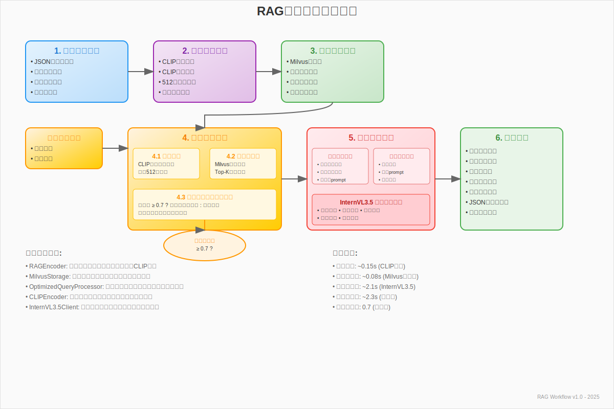

# RAG知识库使用流程文档

## 📋 概述

本文档详细介绍AI古董鉴定系统中RAG（Retrieval-Augmented Generation）知识库的使用流程，包括数据准备、向量编码、存储检索和智能分析的完整工作流程。

## 🏗️ RAG系统架构



RAG系统由以下核心组件构成：

### 核心组件
- **RAGEncoder**: 负责将古董图文数据编码为向量
- **MilvusStorage**: 管理向量数据在Milvus数据库中的存储
- **OptimizedQueryProcessor**: 优化的查询处理器，实现智能检索和分析
- **CLIPEncoder**: 使用CLIP模型进行图像和文本的向量编码
- **InternVL3.5Client**: 多模态大语言模型客户端

### 数据流向
```
原始数据 → 向量编码 → 向量存储 → 相似度检索 → 智能分析 → 结果输出
```

### 架构层次说明

1. **数据准备层**: 处理JSON格式数据集、古董图像和文本描述
2. **向量编码层**: 使用CLIP模型将图像和文本转换为512维向量
3. **存储检索层**: Milvus向量数据库提供高效的相似度检索
4. **智能分析层**: 基于检索结果的两阶段分析策略
5. **结果输出层**: 结构化的鉴定报告和性能统计

## 🔄 完整使用流程

### 1. 数据准备阶段

#### 1.1 数据集格式
系统支持JSON格式的古董数据集，包含以下结构：

```json
{
  "entries": [
    {
      "antique_metadata": {
        "antique_id": 1,
        "name": "汉朝青铜鼎",
        "dynasty": "汉朝",
        "category": "青铜器"
      },
      "images": [
        {
          "image_id": "img_001",
          "file_path": "/path/to/image.jpg",
          "description": "正面视图",
          "view_angle": "front",
          "format": "jpg",
          "width": 1024,
          "height": 768
        }
      ],
      "texts": [
        {
          "text_id": "txt_001",
          "content": "汉朝时期青铜鼎，工艺精美...",
          "text_type": "description",
          "language": "zh-CN"
        }
      ]
    }
  ]
}
```

#### 1.2 元数据生成
系统会为每个古董条目生成元数据文件：

```json
{
  "id": "汉朝_雕塑_20250913_154348",
  "generated_at": "2025-09-13T15:43:49.052178",
  "description": {
    "name": "汉朝时期文物",
    "category": "雕塑",
    "dynasty": "汉朝",
    "appearance": "汉朝时期雕塑，造型独特，工艺精美",
    "historical_background": "汉朝时期文物具有重要的历史价值",
    "cultural_significance": "具有重要的历史、艺术和文化价值",
    "preservation_status": "保存完好，细节清晰可见",
    "collection_value": "具有极高的收藏价值和研究意义"
  }
}
```

### 2. 向量编码阶段

#### 2.1 RAGEncoder工作流程

```python
# 初始化编码器
rag_encoder = RAGEncoder()

# 编码单个条目
vectors = rag_encoder.encode_rag_entry(entry_dict)

# 编码整个数据集
all_vectors, stats = rag_encoder.encode_dataset(dataset_path)
```

#### 2.2 向量数据结构
每个向量包含以下信息：

```python
@dataclass
class VectorData:
    vector_id: str          # 向量唯一标识
    antique_id: int         # 古董ID
    vector_type: str        # 'image' 或 'text'
    vector: List[float]     # 512维向量
    source_id: str          # 源数据ID
    metadata: Dict[str, Any] # 元数据信息
```

#### 2.3 编码过程
1. **图像编码**: 使用CLIP模型将古董图像编码为512维向量
2. **文本编码**: 使用CLIP模型将文本描述编码为512维向量
3. **批量处理**: 支持批量编码提高效率
4. **错误处理**: 自动跳过损坏的图像或文本

### 3. 向量存储阶段

#### 3.1 Milvus集合结构

```python
# 集合字段定义
fields = [
    {"name": "id", "type": "int64", "is_primary": True, "auto_id": True},
    {"name": "vector_id", "type": "varchar", "max_length": 100},
    {"name": "antique_id", "type": "int64"},
    {"name": "vector_type", "type": "varchar", "max_length": 20},
    {"name": "source_id", "type": "varchar", "max_length": 100},
    {"name": "vector", "type": "float_vector", "dim": 512},
    {"name": "metadata", "type": "json"}
]
```

#### 3.2 存储流程

```python
# 初始化存储器
storage = RAGMilvusStorage()

# 批量插入向量
result = storage.batch_insert_vectors(vectors, batch_size=100)

# 创建索引以提高检索性能
storage.create_index()
```

### 4. 智能检索阶段

#### 4.1 OptimizedQueryProcessor工作原理

优化查询处理器实现了智能的两阶段检索策略：

**阶段1：向量相似度检索**
```python
# 对输入图像进行编码
query_vector = clip_encoder.encode_image(image)

# 在Milvus中检索相似向量
similar_results = milvus_client.search(
    collection_name="rag_antique_vectors",
    query_vectors=[query_vector],
    limit=5,  # top-5结果
    search_params={"metric_type": "COSINE"}
)
```

**阶段2：相似度判断与增强**
```python
# 检查最高相似度是否达到阈值
max_similarity = max([result['distance'] for result in similar_results])

if max_similarity >= similarity_threshold:  # 默认0.7
    # 使用检索到的元数据增强prompt
    enhanced_prompt = build_enhanced_prompt(text_query, metadata_context)
    response = internvl3_5_client.chat_about_antique(enhanced_prompt, image)
else:
    # 直接使用大模型分析
    response = internvl3_5_client.chat_about_antique(text_query, image)
```

#### 4.2 元数据上下文构建

系统会将检索到的相似古董的元数据整合为上下文：

```python
def _build_metadata_context(self, similar_results):
    context_parts = []
    
    for i, result in enumerate(similar_results, 1):
        metadata = result.get('entity', {}).get('metadata', {})
        
        context_part = f"""
参考古董{i}（相似度: {result['distance']:.3f}）:
- 名称: {metadata.get('name', '未知')}
- 朝代: {metadata.get('dynasty', '未知')}
- 类别: {metadata.get('category', '未知')}
- 描述: {metadata.get('description', '无描述')}
- 工艺特点: {metadata.get('craftsmanship', '未知')}
- 历史价值: {metadata.get('historical_value', '未知')}
        """
        context_parts.append(context_part)
    
    return "\n".join(context_parts)
```

### 5. 智能分析阶段

#### 5.1 增强型分析流程

当检索到高相似度的古董时，系统会构建增强型prompt：

```python
def _build_enhanced_prompt(self, text_query, metadata_context):
    return f"""
作为专业的古董鉴定专家，请基于以下参考信息分析用户提供的古董图片：

【参考古董信息】
{metadata_context}

【用户查询】
{text_query}

【分析要求】
请结合参考古董的特征，对用户提供的古董进行详细分析，包括：
1. 文物类型和基本特征识别
2. 年代和朝代判断（参考相似古董的时代特征）
3. 材质和工艺技术分析
4. 真伪评估和品相判断
5. 历史文化价值评估
6. 收藏和投资建议

请提供专业、详细的鉴定分析报告。
"""
```

#### 5.2 流式输出支持

系统支持流式输出，提供实时的分析结果：

```python
# 流式分析
for text_chunk in processor.process_image_text_query_stream(image, query):
    print(text_chunk, end='', flush=True)
```

### 6. 结果输出阶段

#### 6.1 分析结果结构

```python
{
    "success": True,
    "analysis_type": "metadata_enhanced",  # 或 "standard"
    "similarity_info": {
        "max_similarity": 0.85,
        "threshold_met": True,
        "similar_count": 3
    },
    "similar_antiques": [
        {
            "antique_id": 1,
            "similarity": 0.85,
            "metadata": {...}
        }
    ],
    "analysis_result": "详细的鉴定分析报告...",
    "processing_time": 2.34,
    "timestamp": "2025-01-15T10:30:45"
}
```

#### 6.2 性能统计

系统会记录详细的性能统计信息：

```python
{
    "vector_encoding_time": 0.15,
    "similarity_search_time": 0.08,
    "llm_inference_time": 2.11,
    "total_processing_time": 2.34,
    "vectors_searched": 1000,
    "similar_results_found": 5
}
```

## 🔧 配置参数

### 关键参数说明

| 参数 | 默认值 | 说明 |
|------|--------|------|
| `similarity_threshold` | 0.7 | 相似度阈值，超过此值使用元数据增强 |
| `top_k` | 5 | 检索的相似结果数量 |
| `vector_dim` | 512 | CLIP向量维度 |
| `batch_size` | 100 | 批量处理大小 |
| `max_tokens` | 2048 | 大模型最大输出长度 |
| `temperature` | 0.1 | 大模型生成温度 |

### 环境变量配置

```bash
# Milvus配置
MILVUS_HOST=localhost
MILVUS_PORT=19530
MILVUS_COLLECTION_NAME=rag_antique_vectors

# CLIP模型配置
CLIP_MODEL_NAME=openai/clip-vit-base-patch32
CLIP_DEVICE=cpu

# InternVL3.5配置
INTERNVL3_5_MODEL_PATH=/path/to/internvl3.5
INTERNVL3_5_MAX_TOKENS=2048
INTERNVL3_5_TEMPERATURE=0.1

# RAG配置
RAG_SIMILARITY_THRESHOLD=0.7
RAG_TOP_K=5
RAG_ENABLE_CACHE=true
```

## 🚀 使用示例

### 基础使用

```python
from ai_core.optimized_query_processor import OptimizedQueryProcessor
from PIL import Image

# 初始化处理器
processor = OptimizedQueryProcessor(
    similarity_threshold=0.7,
    top_k=5
)

# 加载图像
image = Image.open("antique_image.jpg")

# 执行分析
result = processor.process_image_text_query(
    image=image,
    text_query="请分析这件古董的年代和价值"
)

print(f"分析类型: {result['analysis_type']}")
print(f"分析结果: {result['analysis_result']}")
```

### 流式分析

```python
# 流式分析，实时输出结果
for chunk in processor.process_image_text_query_stream(
    image=image,
    text_query="请详细分析这件古董"
):
    print(chunk, end='', flush=True)
```

### 批量处理

```python
from ai_core.rag_knowledge_base.rag_encoder import RAGEncoder
from ai_core.rag_knowledge_base.milvus_storage import RAGMilvusStorage

# 批量编码和存储
encoder = RAGEncoder()
storage = RAGMilvusStorage()

# 处理数据集
vectors_file = encoder.process_dataset("dataset.json")
result = storage.load_and_store_vectors(vectors_file)

print(f"成功存储 {result['total_inserted']} 个向量")
```

## 📊 性能优化

### 1. 向量检索优化
- 使用IVF_FLAT索引提高检索速度
- 合理设置nprobe参数平衡精度和速度
- 批量检索减少网络开销

### 2. 模型推理优化
- 使用GPU加速CLIP编码
- 模型量化减少内存占用
- 缓存常用向量结果

### 3. 系统架构优化
- 异步处理提高并发性能
- 连接池管理数据库连接
- 分布式部署支持高并发

## 🔍 故障排除

### 常见问题

1. **Milvus连接失败**
   - 检查Milvus服务是否启动
   - 验证网络连接和端口配置
   - 确认认证信息正确

2. **CLIP模型加载失败**
   - 检查模型文件是否存在
   - 验证GPU/CPU资源是否充足
   - 确认依赖库版本兼容

3. **相似度检索结果为空**
   - 检查集合是否存在数据
   - 验证向量维度是否匹配
   - 确认索引是否正确创建

4. **分析结果质量不佳**
   - 调整相似度阈值
   - 增加训练数据量
   - 优化prompt模板

### 日志分析

系统提供详细的日志记录：

```python
# 启用详细日志
import logging
logging.getLogger('optimized_query_processor').setLevel(logging.DEBUG)

# 查看关键日志
[INFO] 🚀 开始处理图像文本查询
[INFO] 📊 向量编码完成，耗时: 0.15s
[INFO] 🔍 相似度检索完成，找到 5 个结果
[INFO] ✅ 最高相似度: 0.85，超过阈值 0.7
[INFO] 🎯 使用元数据增强分析
[INFO] ⏱️ 总处理时间: 2.34s
```

## 📈 监控指标

### 关键性能指标

- **检索精度**: 相似度分布统计
- **响应时间**: 各阶段耗时分析
- **吞吐量**: 每秒处理请求数
- **资源使用**: CPU、内存、GPU利用率
- **错误率**: 失败请求比例

### 业务指标

- **增强分析比例**: 使用元数据增强的查询占比
- **用户满意度**: 分析结果准确性评估
- **知识库覆盖率**: 能够匹配的查询比例

---

*本文档版本: v1.0*  
*最后更新: 2025-01-15*  
*维护者: AI古董鉴定系统开发团队*